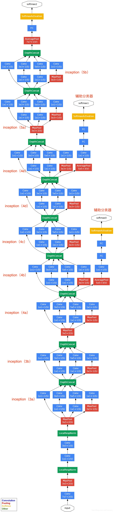

# ImageNet Classification with InceptionNet

This is a PyTorch-based ImageNet-100 image classification project that uses a architecture based on Googlenet(Inception) to train and test on a subset of the ImageNet dataset (100 classes). The TOP-1 accuracy reaches 0.73 using RTX3060 gpu, without the limitation of gpu, you can try to enlarge the batch size of train_data_loader which may help a lot. You can also use Auxiliary Classification or change the architecture of fc to get better performance. 

## Project Structure

```
ImageNet-100-Classification/
├── data/                           # Data directory
│   ├── Labels.json                # Class label mapping file
│   ├── train.X1/                  # Training dataset split 1
│   ├── train.X2/                  # Training dataset split 2
│   ├── train.X3/                  # Training dataset split 3
│   ├── train.X4/                  # Training dataset split 4
│   └── val.X/                     # Validation dataset
├── model/                         # Model save directory
│   ├── mynet_best_model.pth      # Trained model weights
│   └── last_best_model.pth       # Latest best model
├── Inception.py                   # InceptionNet model definition
├── data.py                        # Data loader
├── train.py                       # Training script
├── test.py                        # Testing script
├── requirements.txt               # Python dependencies
└── README.md                      # Project documentation
```

## Requirements

- Python 3.8+
- PyTorch 2.0+
- CUDA 11.x+ (optional, for GPU acceleration)

## Installation

```bash
pip install -r requirements.txt
```

## Model Architecture

### InceptionNet
This project implements a custom InceptionNet architecture featuring:



- **Inception Block**: Multi-scale feature extraction module
  - 1x1 convolution branch
  - 3x3 convolution branch (with 1x1 dimensionality reduction)
  - 5x5 convolution branch (with 1x1 dimensionality reduction)
  - Max pooling branch (with 1x1 projection)

- **Network Structure**:
  - Input size: 224×224×3
  - Convolution layer 1: 7×7, stride=2
  - Convolution layer 2: 1×1 + 3×3
  - Inception modules: 3a, 3b, 4a-4e, 5a-5b
  - Global average pooling
  - Fully connected layers: 1024 → 512 → 256 → 100
  - Output: 100 classes

## Usage

### 1. Train the Model

```
python train.py
```

The training script will:
- Automatically load the dataset
- Train the InceptionNet model
- Save the best model to the `model/` directory
- Output loss and accuracy during training

### 2. Test the Model

```
python test.py
```

The testing script will:
- Randomly select an image from the validation set
- Display the image
- Output prediction results and correct answer
- Show Top-5 prediction results